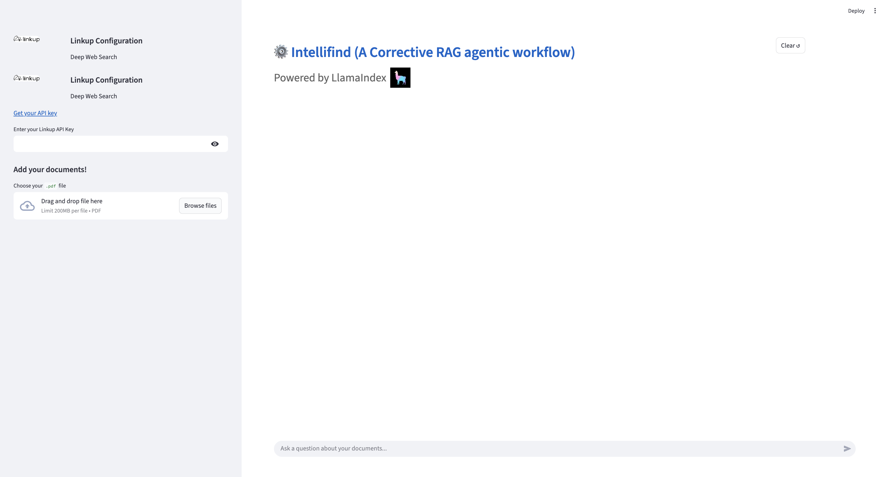

# Intellifind - A corrective RAG workflow 

This repository implements a **context aware RAG (Retrieval-Augmented Generation) workflow** using [LlamaIndex](https://docs.llamaindex.ai/), [Azure OpenAI](https://learn.microsoft.com/en-us/azure/cognitive-services/openai/), and [Linkup](https://linkup.so/).  


The workflow improves the reliability of query answering by:
1. Retrieving from a local index.
2. Evaluating whether retrieved documents are relevant.
3. Falling back to **web search** if retrieved context is insufficient. [**Linkup API** is used for this purpose.]
4. Producing a final answer using a summarization index.


## Preview

<p align="center">
  
</p>

## Demo link 
I have uploaded sample demo on Youtube. You can watch it [here](https://youtu.be/Si-qY43zMy0)


## Pre-requisites. 

First make sure you sign up with Linkup API service , they do provide a free tier. Click this link to register: [here](https://www.linkup.so/). 


## Installation steps 

1. Clone the repository
   
   ```bash
   git@github.com:Akhilesh0013/Intellifind.git
   ```


2. Create and Activate the Virtual Environment. Step 2 shows the commands in MacOS , commands in Windows may vary . If you have issues   with the version , try running it with Python 3.10.11 . Generally, Python >= 3.10 should work

   ```bash
   python -m venv .venv
   source .venv/bin/activate 
   ```


3.  Run Qdrant

    Pull and run the [Qdrant](https://qdrant.tech/) vector database using Docker:

    ```bash
    docker pull qdrant/qdrant
    docker run -p 6333:6333 qdrant/qdrant
    ```

    This will start Qdrant on http://localhost:6333.


4. Configure Environment variables

   Go to your deployed instance Azure AI foundry and fill in the credentials in the .env file . Make sure the **AZURE_OPENAI_ENDPOINT** field in the env file ends with ".com/". For Example : https://xx-region.cognitiveservices.azure.com/


5. Install Dependencies

   ```bash
   pip install -r requirements.txt
   ```


5. Run the Streamlit App

   ```bash
   streamlit run app.py
    ```


##  Acknowledgements

I would like to express our gratitude to the following projects and their contributors for enabling advanced AI experimentation and supporting the open-source ecosystem.


- **[Azure OpenAI Service](https://learn.microsoft.com/en-us/azure/cognitive-services/openai/)**  
  For powering the large language model capabilities that enable natural language understanding and generation.

- **[Qdrant](https://qdrant.tech/)**  
  An open-source vector database that makes efficient and scalable semantic search possible.

- **[LlamaIndex](https://docs.llamaindex.ai/)**  
  For providing a flexible framework to connect LLMs with external data and build custom retrieval-augmented generation workflows.

